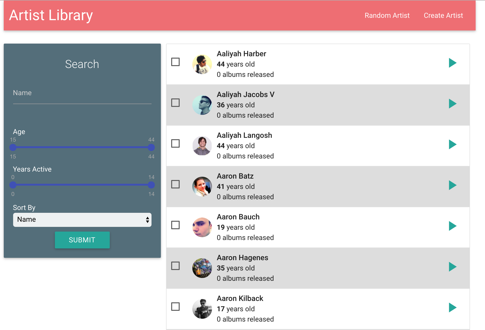
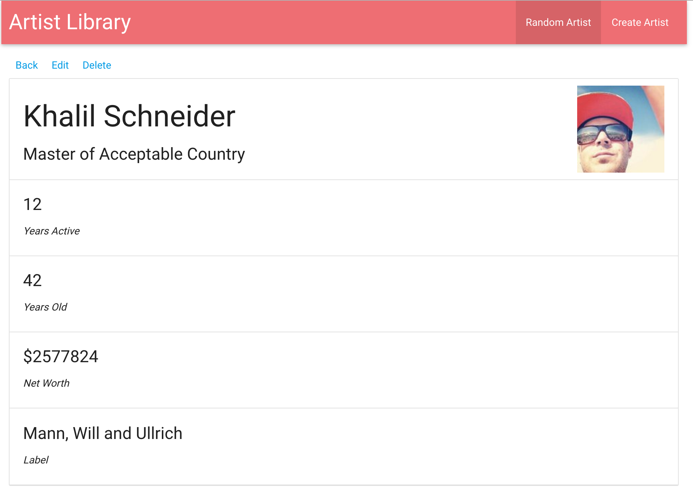
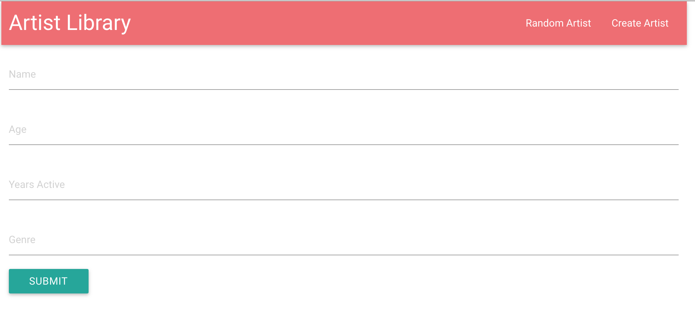

# Filtering, sorting and paginating large data collections

# Description

This repository shows an example on how to handle large Data sets which can be implemented on any real time applications, Built using MongoDB, Mongoose, NodeJS, React, Redux and Electron.

I am using [faker.js](https://github.com/marak/Faker.js/), a fantastic library which generates massive amount of fake data.

HomePage 
ViewArtist 
CreateArtist 

### Set Up
Clone and install:

```bash
git clone https://github.com/hemanth09/artist-library.git
cd artist-library
npm/yarn install
```

### Running the Application

Run it using:

```bash
yarn run start
```
- And the application should open and run on Electron App

Before that you have to start MongoDb and connect to it.
I am assuming you have MongoDB already installed on your computer. We will start the daemon specifying the location of the database.

```bash
mongod --dbpath=/User/username/data/db
```

If not installed follow the below link to install mongodb

- [Installing Mongo](https://treehouse.github.io/installation-guides/mac/mongo-mac.html)
- [Robo 3T](https://robomongo.org/download) You can install Robo 3T which gives a good user interface to manage your MongoDB database.